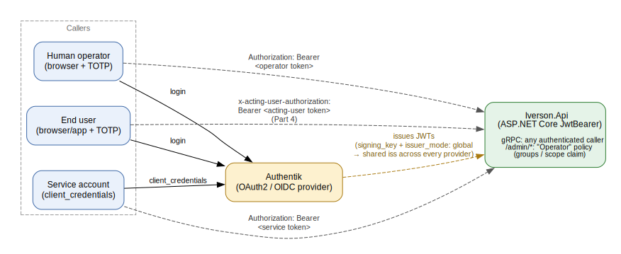

# User Management and Security

Iverson delegates all identity to [Authentik](https://goauthentik.io/), deployed
as a standalone IdP alongside the rest of the stack (`Iverson.Server/deploy/helm/iverson/charts/authentik/`
for kind, or the `authentik-server`/`authentik-worker` services in
`Iverson.Server/docker-compose.yml` for local dev). Authentik is the only place
users, service accounts, groups, and claims are managed — Iverson's own API has
no user database or login form of its own. This document covers:

1. [Architecture in one picture](#architecture-in-one-picture)
2. [Creating a service account (machine-to-machine)](#creating-a-service-account-machine-to-machine)
3. [Creating a human user and granting operator access](#creating-a-human-user-and-granting-operator-access)
4. [Claims and scopes: how authorization decisions are made](#claims-and-scopes-how-authorization-decisions-are-made)
5. [Issuing tokens](#issuing-tokens)
6. [Using tokens from each client SDK](#using-tokens-from-each-client-sdk)
7. [End-user identity propagation ("acting as")](#end-user-identity-propagation-acting-as)
8. [Reference: every provisioned client](#reference-every-provisioned-client)
9. [Troubleshooting](#troubleshooting)

> **Status note:** Sections 1–6 and 8 (client-credentials service accounts,
> operator/admin auth) are implemented and merged to `main`. Section 7
> (end-user identity propagation — the `x-acting-user-authorization` header
> and everything under it) is complete and live-verified but currently lives
> on the `worktree-end-user-identity-propagation` branch, not yet merged.
> Authorization decisions based on *who* the acting end-user is (as opposed to
> just proving the plumbing works) is a separate, not-yet-built piece ("Part 5").

---

## Architecture in one picture



Every caller — human or machine — authenticates against Authentik and
presents the resulting JWT to `Iverson.Api` as a standard `Authorization:
Bearer <token>` header (gRPC metadata is just the HTTP/2 header set, so this
works identically for gRPC calls and the 3 admin HTTP endpoints). There is no
separate Iverson-side session, API key, or user table.

Two independent authorization tiers exist on the API side today
(`Iverson.Server/Iverson.Api/Program.cs:100-109`):

| Surface | Policy | What it checks |
|---|---|---|
| The 4 gRPC services (`ObjectMapping`, `ObjectPersistence`, `ObjectRetrieval`, `ObjectSearch`) | `FallbackPolicy` | Any authenticated caller — token just has to be valid and in `ValidAudiences`. No group/scope check. |
| The 3 `/admin/*` HTTP endpoints (`POST /admin/reconcile/{typeName}`, `GET /admin/dlq`, `POST /admin/dlq/{id}/replay`) | `"Operator"` policy | The token's `groups` claim contains `operators`, **or** its `scope` claim contains `admin`. |

---

## Creating a service account (machine-to-machine)

A "service account" in Authentik terms is an OAuth2 **provider** using the
`client_credentials` grant, bound to an **Application**. Every existing
service caller (the load-test harness, a web-test caller, the admin-automation
client) is provisioned this way, entirely as config-as-code via Authentik
**Blueprints** — YAML files applied automatically by the `authentik-worker`
process, no manual UI steps.

**To add a new service account**, add a provider + application pair to the
blueprint file for your target environment:

- **docker-compose:** `Iverson.Server/deploy/helm/iverson/charts/authentik/blueprints/compose-only/service-clients.yaml`
  — hardcoded dev `client_id`/`client_secret` literal strings (fine for local
  dev only; never use this file's pattern for a real deployment).
- **kind/Helm:** `Iverson.Server/deploy/helm/iverson/charts/authentik/templates/blueprints-configmap-service-clients.yaml`
  — client_id/secret are generated once via `randAlphaNum` and persisted in a
  `lookup`-guarded Kubernetes Secret (`templates/secret-service-clients.yaml`),
  so re-running `helm upgrade` never rotates them.

Minimal provider block (mirrors the existing `iverson-loadtest` entry):

```yaml
- model: authentik_providers_oauth2.oauth2provider
  identifiers:
    name: my-new-service
  attrs:
    client_type: confidential
    client_id: "dev-my-new-service-client-id"
    client_secret: "dev-only-not-for-production-my-new-service-secret"
    signing_key: !Find [authentik_crypto.certificatekeypair, [name, "authentik Self-signed Certificate"]]
    issuer_mode: global
- model: authentik_core.application
  identifiers:
    slug: my-new-service
  attrs:
    name: my-new-service
    provider: !Find [authentik_providers_oauth2.oauth2provider, [name, my-new-service]]
```

`signing_key` and `issuer_mode: global` are **not optional** — omit either and
the provider issues unvalidatable `HS256` tokens or an inconsistent `iss` per
Application, respectively (verified during the Part 2+3 design's assumption
checks).

**Then wire it into the API:**
1. Add the new client's `client_id` to `Authentik:ValidAudiences` (an
   env-var-driven array — see [docker-compose env vars](#reference-every-provisioned-client)
   below, or the equivalent kind Secret/ConfigMap wiring).
2. If this service needs `/admin/*` access, also attach the `admin` scope
   mapping (see [Claims and scopes](#claims-and-scopes-how-authorization-decisions-are-made)).
3. `helm dependency build` (if you touched any chart subchart file) then
   `helm upgrade` **twice** on a fresh install (see
   [Troubleshooting](#troubleshooting) — the two-pass requirement).

---

## Creating a human user and granting operator access

Unlike service accounts, **no blueprint creates human operator users or the
`operators` Group** — this is a deliberate design decision (Part 1 spec,
decision #6): group membership is a manual runtime/operational step, not
something to hardcode into version-controlled config.

**Steps (compose or kind):**

1. Log into the Authentik admin UI using the bootstrap credentials:
   - **compose:** `admin@iverson.local` / `dev-admin-password` (hardcoded in
     `docker-compose.yml`, dev-only).
   - **kind:** email from `AUTHENTIK_BOOTSTRAP_EMAIL`, password from the
     `<release>-authentik-app` Secret's `bootstrap-password` key.
2. Create the new user (Directory → Users → Create), or invite them via
   Authentik's normal enrollment flow.
3. Create the `operators` Group once, if it doesn't already exist (Directory
   → Groups → Create, name exactly `operators` — this string is the literal
   value `OperatorAuthorizationPolicy` checks for).
4. Add the user to the `operators` Group.
5. Have the user complete a browser login through the `iverson-oidc-default`
   Application (Authorization Code + PKCE, MFA-enforced — see
   [Issuing tokens](#issuing-tokens)) to confirm their token's `groups` claim
   now contains `operators` and is accepted on `/admin/*`.

This exact procedure (with copy-pasteable verification commands) is also
documented in `docs/runbooks/grpc-admin-auth-cutover.md`, since it's flagged
there as the one path with no automated smoke-test coverage.

> **Note:** As of the Tenant Admin APIs (Part D), manually editing a user's
> `attributes.tenant_id` in the Authentik admin UI, outside `CreateTenant`/
> `InviteUser`, is no longer a supported way to provision a tenant user — any
> `tenant_id` introduced that way has no registry row and is permanently
> denied by the platform's fail-closed tenant-suspension check. The steps
> above (creating an operator) are unaffected and remain the sanctioned path
> for operator onboarding specifically.

---

## Claims and scopes: how authorization decisions are made

Authentik issues claims into a token based on **scope mappings** attached to
the provider that issued it. This repo defines two custom scope mappings
(identical definitions in both the compose and kind blueprint files):

| Scope mapping | Expression | Produces | Attached to |
|---|---|---|---|
| `groups` | `return [group.name for group in user.ak_groups.all()]` | A `groups` claim: array of the human user's Authentik Group names | `iverson-oidc-default` (human operator login) |
| `admin` | `return {}` | Nothing by itself — its mere presence in the token's granted-scope list adds the literal token `admin` to the space-separated `scope` claim | `iverson-admin-automation` (service account) |

`OperatorAuthorizationPolicy.IsSatisfiedBy` (`Iverson.Server/Iverson.Api/OperatorAuthorizationPolicy.cs`)
is the only place these claims are consulted:

```csharp
public static bool IsSatisfiedBy(IEnumerable<string> groupClaims, string? scopeClaim)
{
    if (groupClaims.Contains("operators"))
        return true;
    return scopeClaim is not null && scopeClaim.Split(' ', StringSplitOptions.RemoveEmptyEntries).Contains("admin");
}
```

So there are exactly two independent ways to pass the `"Operator"` policy:
a human whose `groups` claim contains `operators`, **or** a service account
whose `scope` claim contains `admin`. There is currently no finer-grained
claim (e.g. per-row or per-field authorization) — that's explicitly future
work ("Part 5" of the identity initiative), not yet designed.

**To add a new claim:** define a new `authentik_providers_oauth2.scopemapping`
block in the relevant blueprint file, with whatever Python `expression`
computes the value from the `user`/`request` objects Authentik's scope-mapping
sandbox exposes, then attach it to the provider(s) that should issue it via
`property_mappings`. Nothing on the API side needs to change to *receive* a
new claim — `ClaimsPrincipal.FindFirst`/`FindAll` will pick up any claim name
you choose; you only need to change `Program.cs` if you want the API to
actually *act* on the new claim.

---

## Issuing tokens

Two grant types are used, matching the two kinds of caller:

### Service accounts — `client_credentials`

```bash
curl -s -X POST http://localhost:9000/application/o/token/ \
  -d grant_type=client_credentials \
  -d client_id=dev-iverson-loadtest-client-id \
  -d client_secret=dev-only-not-for-production-loadtest-secret-0123456789
```

Returns a JSON body with `access_token` (a JWT), `expires_in`, `token_type`.
No interactive step, no MFA — this is why `client_credentials` is reserved
for machine callers, never issued to a client acting on a human's behalf.

If a service needs `/admin/*` access, request the `admin` scope explicitly —
**property_mappings binding a scope to a provider is necessary but not
sufficient**; Authentik only includes a scope's claims in the issued token if
the token request itself also sends `scope=`:

```bash
curl -s -X POST http://localhost:9000/application/o/token/ \
  -d grant_type=client_credentials \
  -d client_id=dev-iverson-admin-automation-client-id \
  -d client_secret=dev-only-not-for-production-admin-secret-0123456789 \
  -d scope=admin
```

### Human users — Authorization Code + PKCE

This is a standard OIDC browser login (Authentik's own hosted login pages),
MFA-enforced (`blueprints/mfa-enforcement.yaml` requires TOTP or WebAuthn —
either satisfies it, no SMS/email OTP by design). There is no headless "mint
me a human token" endpoint by design — a human token is only ever obtained by
a human actually authenticating (or, for automated testing, by scripting the
same flow a human would go through — see below).

For the admin-operator login, this happens through `Iverson.AdminUI` (the
admin dashboard), which initiates the `iverson-oidc-default` Application's
Authorization Code flow; Authentik handles the login UI itself.

**For automated/scripted testing of a human-equivalent login** (used by the
Part 4 acting-user smoke test, and adaptable for any other scripted
human-login test), `Iverson.Server/deploy/scripts/mint_acting_user_token.py`
drives Authentik's flow-executor API (`/api/v3/flows/executor/<slug>/`)
programmatically:

```bash
python3 Iverson.Server/deploy/scripts/mint_acting_user_token.py --target compose
python3 Iverson.Server/deploy/scripts/mint_acting_user_token.py --target kind
```

It walks identification → password → TOTP (enrolling a device on first run,
solving on every run after — the secret is cached under `~/.cache/iverson/`,
`chmod 600`, since Authentik never re-exposes an enrolled device's secret) →
Authorization Code + PKCE, and prints the resulting access token to stdout.
Full CLI:

```
--target {compose,kind}   required
--username                default: iverson-acting-user-smoke-test
--password                default: per-target (fixed dev value for compose, read from a kind Secret)
--client-id               default: per-target (fixed dev value for compose, read from a kind Secret)
--redirect-uri            default: matches the provisioned client's redirect_uris
--base-url                override the computed base URL entirely
--host-header             override the computed Host header (empty string disables the override)
--flow-slug               default: default-authentication-flow
--release                 default: iverson (kind only — Helm release name)
--namespace               default: iverson (kind only)
--kind-local-port         default: 19000 (kind only — local port for kubectl port-forward)
```

The `--target` flag matters because compose and kind differ in base URL,
`client_id`, and (a live-verified gotcha, not initially expected) **both**
targets need a forced `Host` header — Authentik derives the `iss` claim from
the *request's* Host header, so a token minted by hitting `localhost:9000`
directly gets a different `iss` than what `iverson-api`'s own OIDC discovery
resolves internally. See [Troubleshooting](#troubleshooting).

---

## Using tokens from each client SDK

Every SDK follows the same shape: construct a credentials object with
`client_id`/`client_secret`/token endpoint (+ optional `scope`), attach it to
the client, and the SDK fetches/caches the token itself (refreshing shortly
before expiry) and attaches `Authorization: Bearer <token>` to every RPC via
that language's native gRPC call-credentials mechanism.

**.NET** (`Iverson.Clients/DotNet/Iverson.Client.Core/`):
```csharp
services.AddIversonClient(
    grpcEndpoint: "http://iverson-api:8080",
    credentials: new IversonClientCredentials(
        "dev-iverson-loadtest-client-id",
        "dev-only-not-for-production-loadtest-secret-0123456789",
        "http://authentik-server:9000/application/o/token/"));
```
Note: requires `UnsafeUseInsecureChannelCallCredentials = true` internally
(already handled by `AddIversonClient`) — without it, grpc-dotnet silently
drops the header over plaintext h2c.

**Go** (`Iverson.Clients/Go/iverson/`):
```go
creds := &iverson.OAuth2ClientCredentials{
    ClientID: "dev-iverson-loadtest-client-id",
    ClientSecret: "dev-only-not-for-production-loadtest-secret-0123456789",
    TokenEndpoint: "http://authentik-server:9000/application/o/token/",
}
client, _ := iverson.NewIversonClient("iverson-api:8080",
    grpc.WithTransportCredentials(insecure.NewCredentials()),
    grpc.WithPerRPCCredentials(creds))
```

**Java** (`Iverson.Clients/Java/client/`):
```java
CallCredentials creds = new OAuth2ClientCredentials(
    "dev-iverson-loadtest-client-id",
    "dev-only-not-for-production-loadtest-secret-0123456789",
    "http://authentik-server:9000/application/o/token/");
try (IversonClient client = new IversonClient("iverson-api", 8080, creds)) { ... }
```
No special insecure-channel opt-in needed (unlike .NET).

**Python** (`Iverson.Clients/Python/`):
```python
from iverson_client import IversonClient, IversonClientCredentials

client = IversonClient(
    host="iverson-api", port=8080,
    credentials=IversonClientCredentials(
        "dev-iverson-loadtest-client-id",
        "dev-only-not-for-production-loadtest-secret-0123456789",
        "http://authentik-server:9000/application/o/token/"))
```
Plain `insecure_channel` + call credentials is rejected outright by grpcio;
the SDK internally composes `local_channel_credentials()` with the call
credentials to work around this.

**TypeScript** (`Iverson.Clients/TypeScript/`):
```ts
import { createOAuth2ClientCredentials, IversonClient } from '@iverson/client';

const creds = createOAuth2ClientCredentials(
  'dev-iverson-loadtest-client-id',
  'dev-only-not-for-production-loadtest-secret-0123456789',
  'http://authentik-server:9000/application/o/token/');
const client = new IversonClient('iverson-api', 8080, false, creds);
```
> **Known gap:** `createOAuth2ClientCredentials` is not currently re-exported
> from the package's public barrel (`src/index.ts`) — until that's fixed,
> import it directly from the built `auth.js` module rather than the
> top-level package.

None of the 5 SDKs' README/sample code currently shows real credential
values wired up end-to-end (all real usage today is in each SDK's own auth
unit test) — the snippets above are the realistic minimal wiring, assembled
from each constructor's actual signature.

---

## End-user identity propagation ("acting as")

*(Part 4 — complete and live-verified, not yet merged to `main`.)*

For calls made by a service **on behalf of** a specific human end user (as
opposed to the service acting under its own identity), a **second** token —
the end user's own Authentik-issued access token — is attached alongside the
service's existing `Authorization` header, as a separate gRPC metadata entry:

```
x-acting-user-authorization: Bearer <end-user's own token>
```

This is validated by a second, independent ASP.NET Core JwtBearer scheme
(`"ActingUser"`, its own `Authentication:ActingUser:Authority`/
`ValidAudiences` config) via a global gRPC interceptor
(`Iverson.Server/Iverson.Api/Grpc/ActingUserInterceptor.cs`). **Important:**
today this interceptor only *validates* the token and logs a structured line
(`service {ServiceAccountSubject} acting as user {ActingUserSub} called
{Method}`) — it does not change what the call is allowed to do or what data
it returns. That's the deliberately separate, not-yet-built "Part 5"
(row/field-level authorization). If the header is absent, calls proceed
exactly as before (this is optional, backward-compatible plumbing).

**Per-call header helpers**, one per SDK, all keyed on the same metadata
constant `x-acting-user-authorization`:

| SDK | Helper |
|---|---|
| .NET | `new Metadata().WithActingUser(token)` (extension method, `Iverson.Client.Core/ActingUserMetadata.cs`) |
| Go | `iverson.WithActingUserToken(ctx, token)` then dial normally — read automatically inside `GetRequestMetadata` |
| Java | `stub.withOption(OAuth2ClientCredentials.ACTING_USER_TOKEN, token)` |
| Python | `stub.Search(request, metadata=acting_user_metadata(token))` |
| TypeScript | `createActingUserMetadata(token)` passed as the call's metadata |

**Provisioning:** a dedicated public/PKCE OAuth2 client `iverson-loadtest-human`
(no client secret — PKCE only) plus a dedicated test human user
(`iverson-acting-user-smoke-test`, TOTP-enforced like any other human login)
exist in both the compose and kind blueprints, for exercising this path in
automated tests without touching real operator accounts. Minting a token for
this flow uses the same `mint_acting_user_token.py` script described above —
the acting-user token *is* just a normal human OIDC token, obtained the same
way an operator's token would be, from a different (public, PKCE-only)
client.

**Live verification evidence** (both docker-compose and a kind cluster) is in
`.superpowers/sdd/task-11-report.md` in the worktree — includes the exact
live flow-executor JSON shapes for every stage (identification, password,
TOTP enrollment vs. solve, final redirect), useful as a reference for any
future Authentik flow-executor scripting in this repo.

---

## Reference: every provisioned client

| Client | Grant type | client_type | client_id (compose, fixed dev value) | Scope/claim granted | Used for |
|---|---|---|---|---|---|
| `iverson-loadtest` | `client_credentials` | confidential | `dev-iverson-loadtest-client-id` | — | Load-test service caller |
| `iverson-webtest` | `client_credentials` | confidential | `dev-iverson-webtest-client-id` | — | External web-test service caller |
| `iverson-admin-automation` | `client_credentials` | confidential | `dev-iverson-admin-automation-client-id` | `admin` scope → `scope` claim | CI/automation calling `/admin/*` |
| `iverson-oidc-default` (app slug `iverson-api`) | Authorization Code + PKCE | public | `dev-iverson-human-oidc-client-id` | `groups` scope → `groups` claim | Human operator browser login |
| `iverson-loadtest-human` *(Part 4, unmerged)* | Authorization Code + PKCE | public, no secret | `dev-iverson-loadtest-human-client-id` | — | Scripted acting-user smoke test |

On kind, every `client_id`/`client_secret` above is instead generated once
and stored in a `lookup`-guarded Secret (`<release>-authentik-{loadtest,
webtest,admin-automation,human-oidc,loadtest-human}-client`), read into the
API's `Authentication:ValidAudiences` env vars at deploy time.

**docker-compose `Authentication__*` env vars** (`Iverson.Server/docker-compose.yml`,
`iverson-api` service):
```
Authentication__Authority=http://authentik-server:9000/application/o/iverson-api/
Authentication__ValidAudiences__0=dev-iverson-human-oidc-client-id
Authentication__ValidAudiences__1=dev-iverson-loadtest-client-id
Authentication__ValidAudiences__2=dev-iverson-webtest-client-id
Authentication__ValidAudiences__3=dev-iverson-admin-automation-client-id
Authentication__ActingUser__Authority=http://authentik-server:9000/application/o/iverson-api/
Authentication__ActingUser__ValidAudiences__0=dev-iverson-loadtest-human-client-id
```
(The `ActingUser__*` lines are Part 4, unmerged.)

---

## Troubleshooting

For anything beyond this document, two runbooks cover known operational
gotchas in detail:

- **`docs/runbooks/grpc-admin-auth-cutover.md`** — the two-pass `helm upgrade`
  requirement on a fresh install (blueprint ConfigMap and Secrets render in
  the same pass, so `lookup` sees nothing the first time), confirming
  asynchronous blueprint application via the `authentik-worker`'s task queue,
  why a pod restart may be needed after Secrets converge (`secretKeyRef` env
  vars resolve once at pod creation), and the manual operator-login
  verification procedure.
- **`docs/runbooks/kind-cluster-troubleshooting.md`** §5.1–§5.3 — the
  Host-header/issuer-claim mismatch trap when minting tokens through
  `kubectl port-forward` (or even `localhost:9000` on compose — this turned
  out not to be kind-specific), why `kubectl get pod -o jsonpath` never shows
  secret-resolved env values (use `kubectl exec ... -- printenv` instead),
  and a wrong-HTTP-verb trap that looks like an auth failure but is actually
  a routing miss.

**Quick diagnostic checklist for "my token doesn't work":**
1. Decode the JWT (e.g. `python3 -c "import base64,json,sys; print(json.dumps(json.loads(base64.urlsafe_b64decode(sys.argv[1].split('.')[1]+'==')), indent=2))" "$TOKEN"`) and check `iss` matches the API's configured `Authority` exactly, `aud` is in `ValidAudiences`, and `exp` hasn't passed.
2. If minted via `curl`/`kubectl port-forward`, confirm you forced the `Host` header to match the API's `Authority` hostname — see the runbook section above.
3. For `/admin/*` 403s specifically, decode the token and check for a `groups` claim containing `operators` or a `scope` claim containing `admin` — `FallbackPolicy`-only surfaces (gRPC) don't need either.
4. If a service account's token is missing an expected claim, confirm the client's provider actually requested that scope in the token request (`scope=` parameter) — binding a scope mapping to a provider is necessary but not sufficient.
